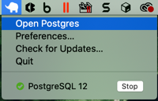
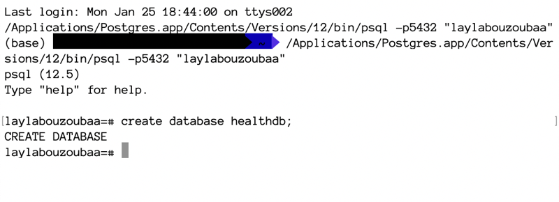
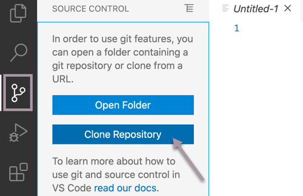
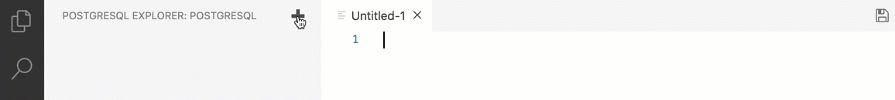
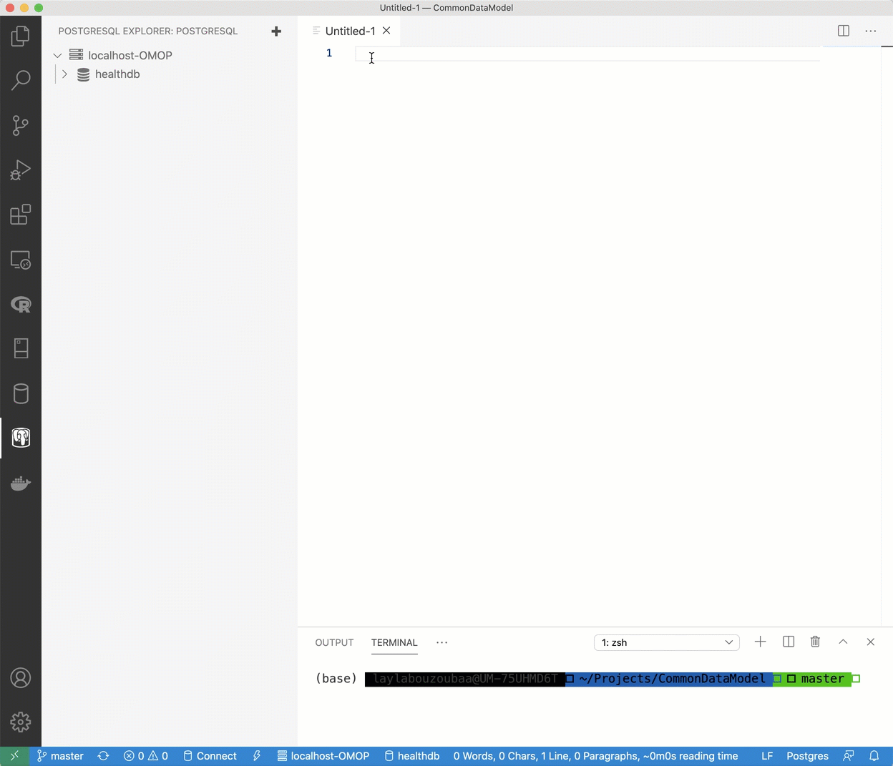
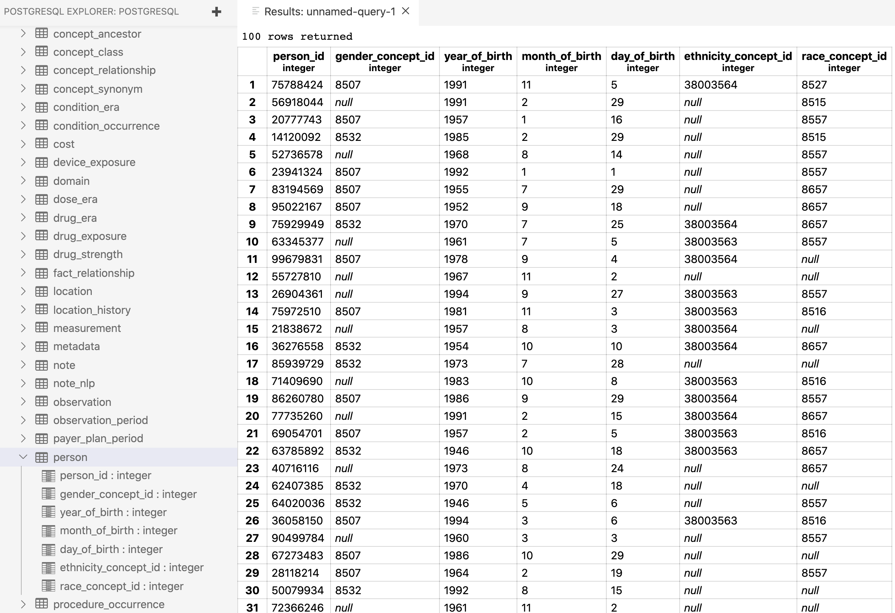

```{r setup, include=FALSE}
knitr::opts_chunk$set(eval = FALSE, include = TRUE)
```

## A Little Tale

Recently at work, I was asked to take data that already existed for a specific project and figure out how to standardize it to the Observational Medical Outcomes Partnership (OMOP) [Common Data Model](https://www.ohdsi.org/data-standardization/the-common-data-model/) (CDM). Not only did the data have to conform to this CDM but the values in the database must also follow a specific, validated vocabulary. To give you some background, I work at a medical school where I only work with patient level data and I have never had to normalize the data to any kind of standard. Most of the data I deal with have been primarily collected by the investigator's team and then used for analysis. Rinse and repeat.

Anyway, after a little (read: a lot) of digging, I think I have it somewhat figured - at least enough so that I can get to work. The OMOP CDM was designed to make disparate clinical data - like the kind I work with - conform in a way that it is easier to perform analysis using standardized tools and share the data and its meaning across applications and business processes. Using a CDM, reduces the pain of having to mush together data from multiple sources and applications. For this particular project, doing that was like forcing pieces of a puzzle together with tape so I am totally on board with a CDM. I think you get the picture, now to the good stuff.

What I started with was dozens of datasets in SAS and R. Data that have already been harmonized and aggregated. Several hours into "backwards-reading" thousands of lines of code to find original values with the schema and validated lexicon side by side I was able to get an idea of what was required and what we had:



Thankfully, OMOP has all the sources I needed to get to work: 

* [Standardized vocabularies](https://www.ohdsi.org/web/wiki/doku.php?id=documentation:vocabulary:sidebar)  
* [OHDSI manual](https://ohdsi.github.io/TheBookOfOhdsi/) 
  * [Notes on CDM](https://ohdsi.github.io/TheBookOfOhdsi/CommonDataModel.html#cdm-standardized-tables)
* [Athena OMOP database (ex. Race)](https://athena.ohdsi.org/search-terms/terms?invalidReason=Valid&standardConcept=Standard&vocabulary=Race&page=1&pageSize=15&query=)
* [DDL's](https://github.com/OHDSI/CommonDataModel) *thank foodness for this*
  * BTW Data Defnition Languages (DDLs), if provided, are great as they establish uniformity within your database. In this case, the OMOP has created standards for the tables and fields, the value types and even the constraints for the foreign keys.

## Creating the OMOP CDM Database
Steps (*Note: I assume you already have [PostgreSQL setup](https://www.postgresql.org/docs/13/installation.html))* :  

1. Create PostgreSQL database  
    1. Open PostgreSQL app 
    
    2. Double click the database with your name to open the SQL shell
    
    3. run `create database healthdb;`
    
2. In a database manager or advanced editor (I <3 [Visual Studio Code](https://code.visualstudio.com/)), clone the repo that contains the DDL for PostgreSQL: https://github.com/OHDSI/CommonDataModel.git. I have a special directory on my machine for repos like this.  *The "Source Control" extension comes out of the box when you install VSC for the first time*
3. Add the `healthdb` database to VSC by navigating to the PostgreSQL Explorer, pressing the `+` button and following the prompts (Make sure you have the PostgreSQL [extension](https://marketplace.visualstudio.com/items?itemName=ckolkman.vscode-postgres) for VSC ) You will need to input the credentials you setup when configuring your PostgreSQL application.
 
5. Once a connection to the `healthdb` database has been established, right click the database and select "New Query" and fresh page will appear.
6. Navigate to the File Explorer where the contents of the the OHDSI/CommonDataMmodel repository are (or where you have another DDL you'd like to use). Copy and paste the contents of `OMOP CDM postgresql ddl.txt`, select all, right-click and select "Run Query" 

## Get ODBC Drivers

Before we can get to working with data in RStudio, we need to make sure that RStudio can interface with our database. RStudio can do this through Open Database Connection (ODBC) drivers. For the purposes of this project, I will need two specific drivers:  

1. [Unix ODBC](http://www.unixodbc.org/ )
   * This is neceessary for *nix users as the POStgres ODBC driver on a Mac requires some confg files that does not come with the "out-of-the-box" installation of the PostgreSQL application for Mac
   * Steps:
     1. Download the driver
     2. Open terminal
     3. `cd` to downloaded file
     4. Run these commands:
        1. `gunzip unixODBC*.tar.gz`
        2. `tar xvf unixODBC*.tar`
        3. `cd unixODBC-2.3.9`
        4. `./configure`
        5. `make`
        6. `make install`
2. [PostgreSQL ODBC](https://odbc.postgresql.org/ )
   1. Select /src and download the latest tarball
   2. Unzip
   3. Run [these steps](https://odbc.postgresql.org/docs/unix-compilation.html ) to install the drivers 

## Finally, the fun part...

Working with a database in RStudio is not so bad - there is a lot of [documentation](https://db.rstudio.com/) to help you along. For this part we will only need two packages:

```{r pckages, message=FALSE, warning=FALSE, echo=TRUE, eval=TRUE}
library(tidyverse)
library(DBI)
```

### 'person' table specs
`person_id` = 8 digit int  
`gender_concept_id` = only two standard concepts: FEMALE (concept_id=8532) and MALE (concept_id=8507)  
`year_of_birth` = 4 digit int
`month_of_birth` = 1-2 digit int
`day_of_birth` = 1-2 digit int
`ethnicity_concept_id` = only two categories for data on ethnicity: “Hispanic or Latino” (concept_id=38003563) and “Not Hispanic or Latino” (concept_id=38003564)  
`race_concept_id` = "White"(concept_id = 8527), "Black or African American"(concept_id = 8516), "AI/AN"(concept_id = 8657), "Asian"(concept_id = 8515), "NH/PI"(concept_id = 8557)

*Creating data for the person table*

```{r person, echo=TRUE, eval=TRUE}
person_id <- runif(100, min = 10000000, max = 99999999) %>% as.integer()
gender_concept_id <- c(8532,8507, NA) %>% as.integer()
year_of_birth <- runif(100, 1945, 1996) %>% as.integer()
month_of_birth <- runif(100, 1, 12) %>% as.integer()
day_of_birth <- runif(100, 1, 30) %>% as.integer()
ethnicity_concept_id <- c(38003563, 38003564, NA) %>% as.integer()
race_concept_id <- c(8527, 8516, 8657, 8515, 8557, NA) %>% as.integer()

#combine it all togather
person <- tibble(person_id = person_id,
                 gender_concept_id = sample(gender_concept_id, 100, replace = TRUE),
                 year_of_birth = year_of_birth,
                 month_of_birth = month_of_birth,
                 day_of_birth = day_of_birth,
                 ethnicity_concept_id = sample(ethnicity_concept_id, 100, replace = TRUE),
                 race_concept_id = sample(race_concept_id, 100, replace = TRUE))

head(person, 25)
```

### Write to `healthdb` database

```{r db, echo=TRUE, message=FALSE, warning=FALSE, eval=FALSE}
# Connect to the default postgres database
con <- dbConnect(RPostgres::Postgres(),
                 dbname = 'healthdb',
                 host = 'localhost',
                 port = 5432,
                 password = rstudioapi::askForPassword("Database password"),
                 user = 'laylabouzoubaa')
#test connection
# sql <- "SELECT * FROM person"
# x <- dbGetQuery(con, sql) #successfull

#write `person` to db
dbWriteTable(con, name = "person", value = person, row.names = FALSE, 
             overwrite = TRUE) #success!!!
```

That's it! We now have some people in our `person` table. 


Now to fill in the rest...

