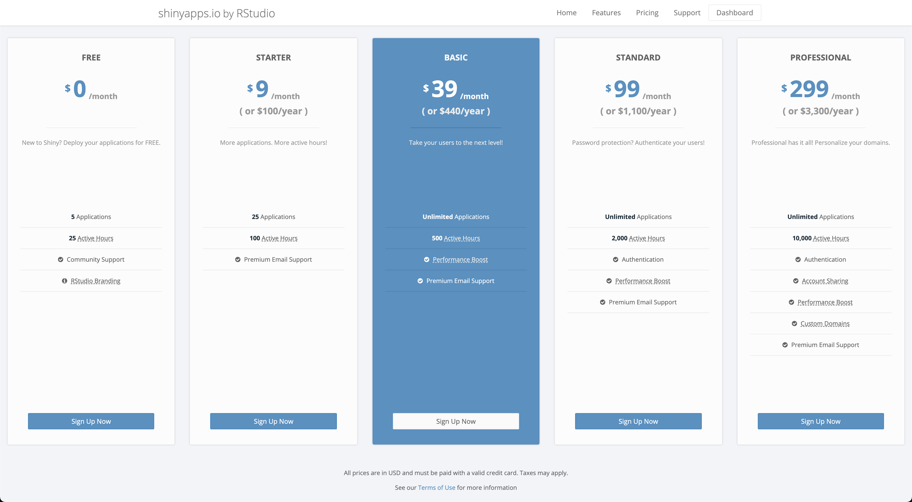
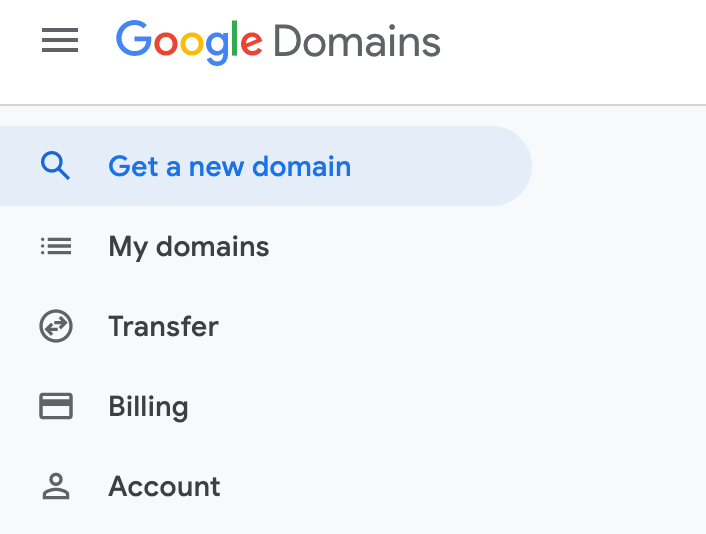
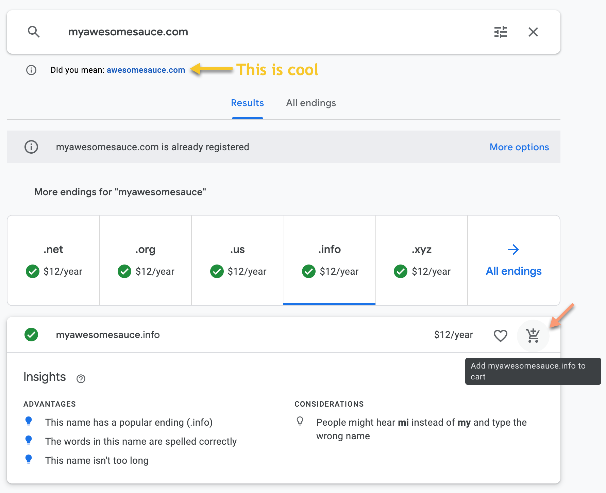
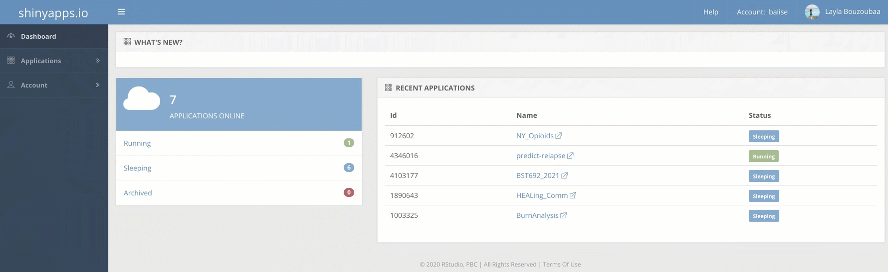
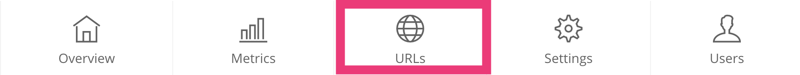
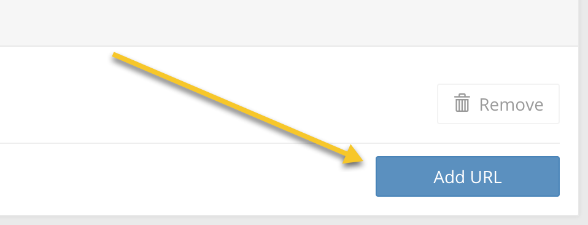
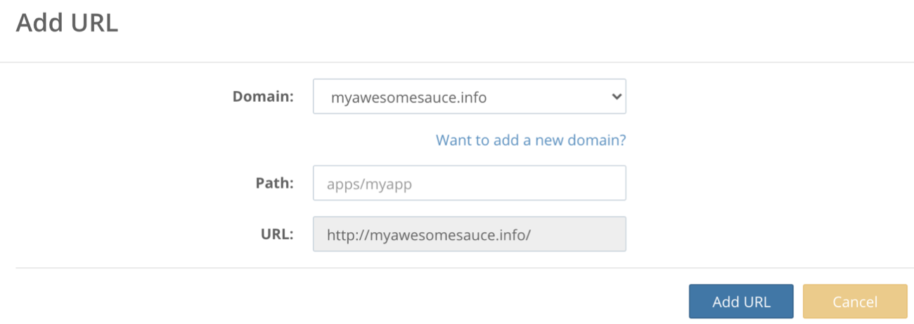
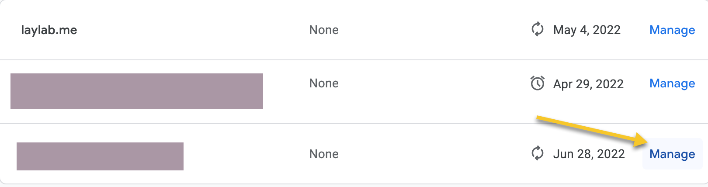

If you're reading this you have probably deployed a Shiny app or two using RStudio's service, [shinyapps.io](https://www.shinyapps.io/). It's a really easy way to get your apps up on the web and ready to share with your peers in a matter of minutes - even if you have the free tier. Unfortunately, if you have the free tier custom domains, like `myawesomesauce.com` is not supported. You must have the *FULL BLOWN Professional Package* at a whopping $299 a month or $3,300 a year (see pricing below)! 😮

If you ask me, this an outrageous amount to pay for some borrowed server space and time. Personally, I would spin up my own virtual machine on any of the cloud providers (my flavor is the Google Cloud Platform) and go from there. If your app does not require a ton of compute resources than this should cost you relatively little money. This topic is making me thirsty for a new post 🤔

If you do not have deep pockets or an employer who is willing to shell out the 💰💰 for this account then, I'm sorry to say, this post is not for you. You are stuck with the `.shinyapps.io\coolApp` domain. *I know, it's pretty lame.*

If you **DO** have the ability to integrate a custom domain, then read further. I have found integrating a domain purchased from Google Domains with a Shiny app tricky at times, so I figured I needed to write a post about it. 

## Step 1. - Google Domains

At this step, I am assuming you can already build a Shiny app, have created a shinyapps.io account, and can deploy your app onto it. If you cannot do the last bit, see this [quick bite](https://docs.rstudio.com/shinyapps.io/getting-started.html#deploying-applications) on how to get your app out on the web!

Once your Shiny app is online, sign into [Google Domains](https://domains.google/) by simply logging in with your Gmail account or any other account you use to access Google services. 

## Step 2. - Purchase a domain!

The domain is the web address that you will connect to your shiny app! 

A few tips on domains:

1. Make it stick. Websites with really long names are really hard to remember so keep it short and relevant!  

2. Be mindful of of your domain extension (`.com`, `.org`). The more popular extension, `.com` will likely be taken but no fret, Google Domains will offer some suggestions that *are* available. Also note that several extensions like `.us` (United States) or `.me` (Montenegro) are country extensions and are intended to be used by entities within that country. However, extensions like `.us` and `.me` are open to registrations worldwide as they also have personal meaning (me and us!) that can be used to connect with your users/personal brand.   
    1. A side note on `.org` - if you're not a bonefied organization, don't use `.org`. That's just confusing, c'mon!
  
3. Lastly, be careful. Buying a domain seems virtually harmless but you *can* get scammed. Only buy from trusted registrars, like Google or GoDaddy, and buy quickly. Do not go online asking the opinion of the internet on your domain name as you run the risk of a "domain name front runner" snatching it up in hopes of selling it for a profit. BTW, domains on Google typically cost $10-25 annually. "Front runners" buy up hundreds of potentially relevant domain names for dirt cheap and are willing to sell them - sometimes at a RIDICULOUS markup. This has happened to my team. Don't say I didn't warn you. 

Once you've decided on a domain add it to cart and checkout! Google will ask you for how long you want to purchase your domain, if you want privacy protection and if you want to turn on auto-renew. I *strongly* recommend you turn on privacy protection. Domain owner information is required for the [WHOIS protocol](https://en.wikipedia.org/wiki/WHOIS) but with privacy protection, Google will supply alternate contact information on your behalf. My name, address and phone number publicly available? No thank you!

Note: After purchasing your domain, it may take up to 24 hours register. If this is your first time using Google Domains, please make sure your email address is verified!

## Step 3. - Linking the Domain to your Shiny app

Login to your [shinyapps.io](https://www.shinyapps.io/) dashboard and navigate to Account > Domains in the sidebar panel. Type in your new domain and press "Add Domain". *NOTE: be sure to add the `www.` in front of your domain.* This is important because when you create your CNAME, you will be telling Google to map your new domain - which includes the `www.` subdomain - to your [shinyapps.io](https://www.shinyapps.io/) account. Your [shinyapps.io](https://www.shinyapps.io/) account also includes the `www.` subdomain so in order to have a successful map, these two components must match.

Then, in the sidebar, navigate to Applications > All and then click on your Shiny app. At the top, click on URLs.

Select the "Add URL" button in the bottom right corner and select your new domain in the popup.

## Step 4. - Adjusting DNS Settings

When I first had to do this, I thought that would be it. It seems like it should be that simple 🤷‍♀️. There is just one last step. We need to make sure Google knows to point your custom domain to your Shiny app account. This is done by creating a Canonical Name a.k.a and [CNAME](https://en.wikipedia.org/wiki/CNAME_record) from `myawesomesauce.info` to `labouz.shinyapps.io`. CNAMEs act as an alias. They essentially point the domain to another resource where information, like host IP address can be found (shinyapps.io).

Go back to your domains.google account and navigate to your newly purchased domain in the left sidebar under "My Domains". Find your domain and select "Manage".

Here is where you need to add the custom resource record under DNS settings. 

That's it! Keep in mind it may take up to 48 hours for setting updates to take effect. While I wait, I typically redeploy my app for good measure :) Enjoy your not lame Shiny app! 🐹
